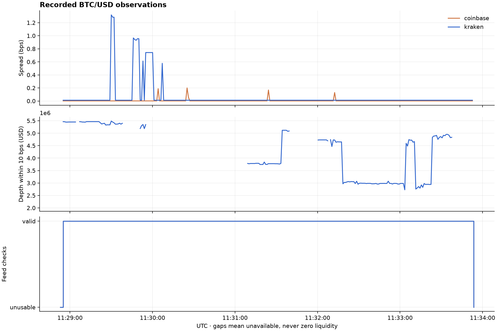
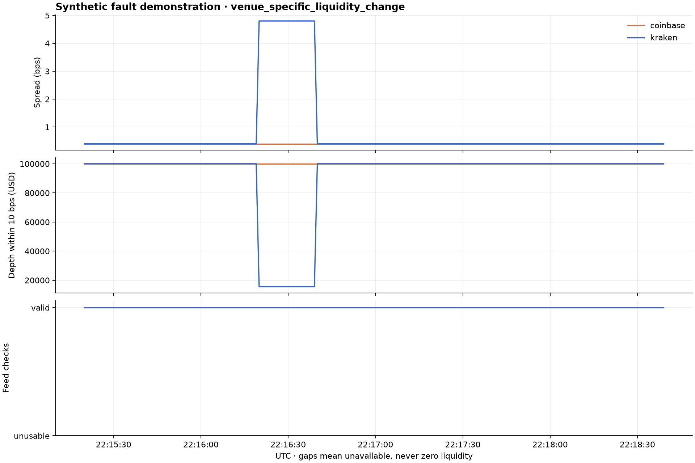
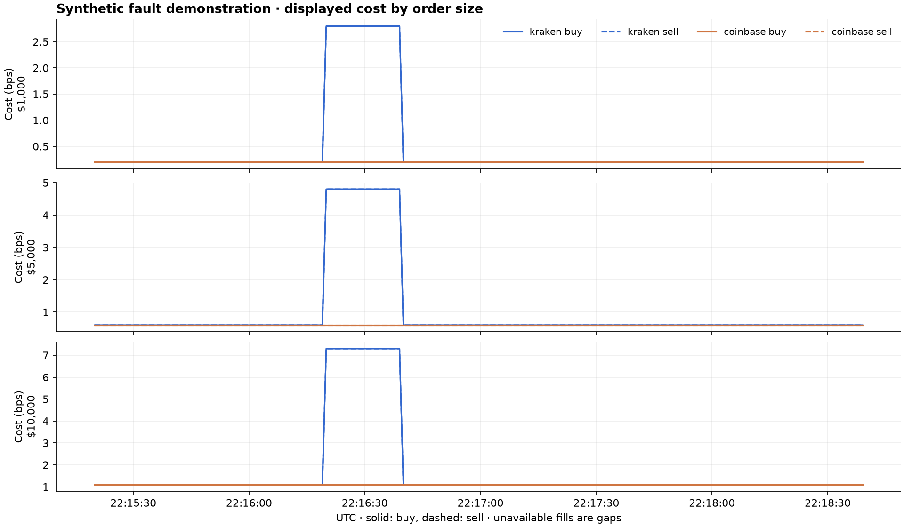
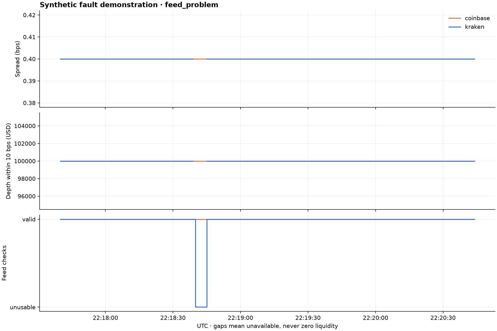

# Liquidity Measurement and Market Data Quality

did displayed liquidity change, or did the data feed become unreliable?

i made this monitor to check that question before treating a wide spread or a fall in depth as a market event. this first release contains a small live sample and two artificial case studies. the live sample checks the recording and replay process. the artificial cases check the event logic.

## the live sample

the evaluation recording contains **300.610 seconds (0.0835 hours)** of BTC/USD observations on 27 september 2026. both feeds were usable for **99.33%** of recorded time. startup and the final connection closure are included in the recording; time outside the recording is unknown.

| result | value |
|---|---:|
| raw feed messages | 15,323 |
| kraken checksum failures | 0 |
| book validation failures | 0 |
| reconnections | 0 |
| detected events | 0 |
| manually reviewed real events | 0 |

the rules were fixed on a separate 90-second pilot recording before this evaluation started. the spread thresholds were 1.978803 bps for Kraken and 0.231085 bps for Coinbase. depth alerts were disabled: neither venue supplied the required 60 complete 10 bps depth observations during the pilot.

these results do not answer how often apparent shocks are genuine liquidity changes or feed problems. there were no detected events, and the recording is much too short to estimate that frequency. there are also insufficient real events to compare spread and depth recovery.

## a measurement limitation that showed up

the common limit is the first 100 price levels on each side. a valid book does not necessarily cover the requested 10 bps band. in evaluation, Kraken covered that band for 177.397 seconds and Coinbase for only 1.010 seconds. the full-band depth measure is unavailable at other times, even if the feed is healthy.

that matters for interpreting the zero-event result: these fixed rules tested spread changes, not depth shocks. i have not treated partial depth as a complete measurement or changed the rules after seeing evaluation data. a later pilot could use a narrower band or deeper Kraken subscription, followed by a separate evaluation period.

## artificial case 1: one venue's displayed liquidity changes

**this is synthetic data, not a recorded market event.** the simulated Kraken book widens from 0.4 to 4.8 bps for 20 seconds. its complete near-mid depth drops from $100,000 to $15,600. Coinbase stays unchanged. Kraken's checksum remains correct and both feeds pass their checks.

the automatic classification is `venue_specific_liquidity_change`, with moderate confidence. the spread and depth return to their earlier range 20 seconds after the start, and the 60-sample recovery run confirms that at 79 seconds. this example deliberately gives both measures the same recovery time; it is not evidence that real spread and depth recover together.

the larger order consumes more levels in the thinner book. the report saves displayed buy and sell cost for $1,000, $5,000, and $10,000, plus peak increases and the 10%, 20%, and 30% recovery-tolerance checks.

## artificial case 2: a corrupted checksum

**this is also synthetic data.** the second case changes the expected Kraken checksum while Coinbase remains healthy. the Kraken book becomes unusable immediately. its spread, depth, and displayed-cost observations disappear until a new connection receives a fresh, valid snapshot.

the automatic classification is `feed_problem`. confidence is high that the observations are unusable under the stated checks; the label makes no claim about market behaviour during the gap. recovery of market liquidity is not measured for this case.

## how the measurements work

the recorder saves each original wire message, UTC receive time, connection ID, session ID, local processing delay, and exchange event time when supplied. connection changes and sampling ticks share the same ordered journal. replay uses those saved receive times and ticks rather than the computer's current clock.

Kraken prices and quantities use decimal values so checksum precision is preserved. all changes in a message are applied in order, zero quantities remove levels, and the book is truncated to the subscribed depth before validation. the CRC32 covers the top 10 asks followed by the top 10 bids. it does not validate every deeper level.

Coinbase uses the public `level2_batch` channel with heartbeats. quantities replace the existing size at a price; they are not added to it. the full Coinbase book is retained locally, then measurements use its first 100 levels. discarding its deeper levels during reconstruction would lose information needed when those prices later move into range.

spread is `(ask - bid) / mid × 10,000`. complete depth is bid and ask notional within 10 bps of the mid-price. each hypothetical dollar order is converted to BTC using that mid-price, then walks the recorded asks for a buy or bids for a sell. insufficient quantity produces an unavailable fill.

## rules and classification

pilot thresholds use the upper 99th spread percentile and lower 1st depth percentile. minimum-change guards require at least 1.5 times the pilot median spread or at most 70% of pilot median depth. liquidity triggers must persist for three sampled seconds. neighbouring triggers are grouped within 60 seconds.

| label | what it means |
|---|---|
| `feed_problem` | a validation or usability check failed; market behaviour cannot be inferred from those observations. |
| `corroborated_liquidity_change` | both usable feeds show a comparable threshold breach within the five-second comparison window. |
| `venue_specific_liquidity_change` | both feeds are usable, but the comparable change is seen on one venue. |
| `uncertain` | comparison coverage, baseline data, or agreement between measures is insufficient. |

the baseline uses the preceding 60 seconds, with at least 20 valid samples. recovery requires 60 consecutive one-second samples within 20% of that baseline. gaps and failed checks break the run. the saved event includes sensitivity at 10% and 30%; an unfinished recovery is `not_observed_to_recover`.

## software checks and manual review

the checks cover Kraken's published checksum example, absolute Coinbase sizes, missing snapshots, crossed books, insufficient displayed quantity, stale books, processing backlog, corrupted checksums, dropped top-level updates, reconnects, and recording-writer failure. the synthetic recording replays twice with identical observations, event records, and summaries. all 301 sampled rows in the live evaluation also matched its replay.

automatic classifications stay unchanged when a manual review disagrees. the report writes a CSV template with event IDs; a reviewer adds a label, their name, and a reason, then passes that file to the report command. reviewed counts and changed labels are reported separately. no real-event manual accuracy estimate is available for this release.

## limits and next recording

this monitor uses a home internet connection and displayed public books. it does not model fees, hidden liquidity, queue position, exchange matching, or actual fills. neither venue's checks guarantee detection of every silent loss of deeper-level updates. UTC event-time comparisons also depend on the local clock.

two venues can corroborate a change but cannot establish its cause or prove that it was market-wide. confidence values are evidence labels, not calibrated probabilities. the artificial cases cannot estimate real false-alert rates.

the next research step is a longer pilot with sufficient depth coverage, followed by multiple later evaluation sessions with the rules left fixed. every alert should be retained and a sample manually reviewed, including uncertain and unusable cases.

## reproduce this release

after installing the project, run `python scripts/reproduce.py --output results/reproduced`. it replays the included live evaluation messages and builds both artificial case studies. raw live recordings are in `recordings/`; figures and generated reports are written to the chosen output directory.

the original pilot observations at calibration are included so their SHA256 can be checked against the frozen rules. the evaluation recording used commit `7e12f59`; later fixes and report work are visible in the repository history. the figures in this note are regenerated by the current replay code.

## exchange references

- [Kraken book checksum and maintenance guide](https://docs.kraken.com/exchange/guides/websockets/book-checksum-v2)
- [Kraken book channel specification](https://docs-legacy.kraken.com/api/docs/websocket-v2/book/)
- [Coinbase Exchange WebSocket channels](https://docs.cdp.coinbase.com/exchange/websocket-feed/channels)
