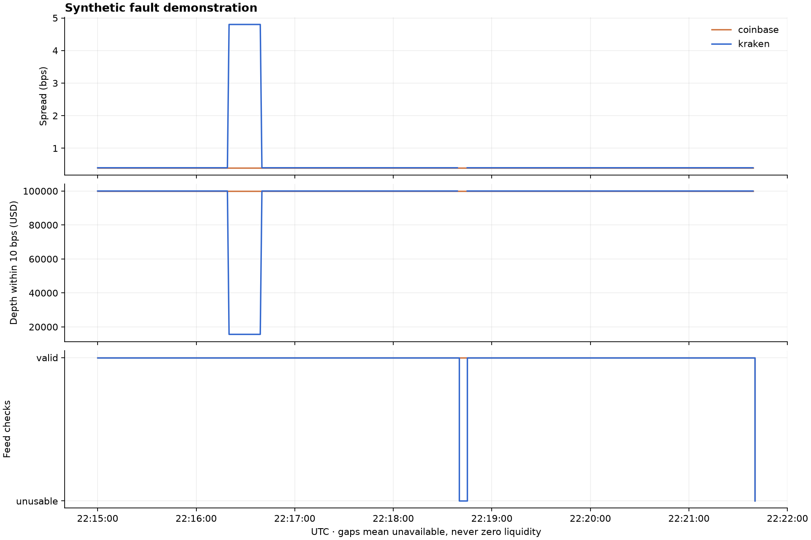
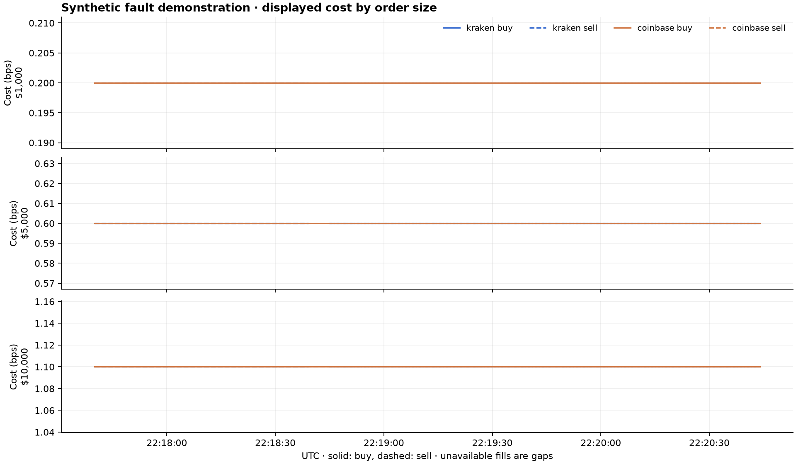

# Liquidity Measurement and Market Data Quality

did displayed liquidity change, or did the feed become unreliable?

**synthetic demonstration — these are artificial events, not market findings.**

phase: evaluation. recorded time: 0.1111 hours.



| venue | valid time | complete 10 bps depth |
|---|---:|---:|
| kraken | 98.75% | 395.0 seconds |
| coinbase | 100.00% | 400.0 seconds |

events: 2. checksum failures: 1. reconnections: 1.

## event records

### syntheti-001

start: 2023-11-14T22:16:20+00:00. last trigger: 2023-11-14T22:16:39+00:00.

classification: **venue_specific_liquidity_change**. confidence: moderate.

both feeds passed checks; only kraken showed a comparable threshold breach.


recovery and peak changes:

```json
{
  "status": "measured",
  "tolerance": 0.2,
  "hold_seconds": 60,
  "venues": {
    "kraken": {
      "spread_bps": {
        "status": "recovered",
        "seconds": 20.0,
        "confirmed_after_seconds": 79.0
      },
      "depth_usd": {
        "status": "recovered",
        "seconds": 20.0,
        "confirmed_after_seconds": 79.0
      },
      "max_spread_increase_bps": 4.3999999999999995,
      "max_depth_reduction_fraction": 0.844,
      "peak_cost_increase_bps": {
        "1000": {
          "buy": 2.5999999999999996,
          "sell": 2.5999999999999996
        },
        "5000": {
          "buy": 4.2,
          "sell": 4.2
        },
        "10000": {
          "buy": 6.199999999999999,
          "sell": 6.199999999999999
        }
      },
      "sensitivity": {
        "0.1": {
          "spread_bps": {
            "status": "recovered",
            "seconds": 20.0,
            "confirmed_after_seconds": 79.0
          },
          "depth_usd": {
            "status": "recovered",
            "seconds": 20.0,
            "confirmed_after_seconds": 79.0
          }
        },
        "0.2": {
          "spread_bps": {
            "status": "recovered",
            "seconds": 20.0,
            "confirmed_after_seconds": 79.0
          },
          "depth_usd": {
            "status": "recovered",
            "seconds": 20.0,
            "confirmed_after_seconds": 79.0
          }
        },
        "0.3": {
          "spread_bps": {
            "status": "recovered",
            "seconds": 20.0,
            "confirmed_after_seconds": 79.0
          },
          "depth_usd": {
            "status": "recovered",
            "seconds": 20.0,
            "confirmed_after_seconds": 79.0
          }
        }
      }
    }
  }
}
```

### syntheti-002

start: 2023-11-14T22:18:40+00:00. last trigger: 2023-11-14T22:18:44+00:00.

classification: **feed_problem**. confidence: high_for_unusable_data.

connection is closed; kraken checksum mismatch.




recovery and peak changes:

```json
{
  "status": "not_measured_for_untrustworthy_or_uncertain_event"
}
```

## manual review

no manual classification reviews have been recorded in this output. automated fault tests are a software check and are reported separately.


## method and limits

measurements use the first 100 levels per side. depth within 10 bps is unavailable unless both recorded sides reach the band boundary. displayed costs walk these levels for $1,000, $5,000, and $10,000 converted to BTC at the current mid-price.

pilot rules use the 99th spread percentile and 1st depth percentile with minimum-change guards. liquidity triggers persist for 3 sampled seconds; neighbouring alerts merge within 60 seconds. classification compares both feeds within 5 seconds of the event start. recovery requires 60 consecutive one-second samples within 20% of the baseline; gaps break that run. 10% and 30% tolerances are also saved in each event record.

Kraken CRC32 verifies the top 10 levels, not every recorded level. Coinbase has no equivalent book checksum here. heartbeat sequence numbers are not used as level2 update sequence numbers. neither feed proves that silent loss of every deeper-level update can be detected.

the book can change before an order arrives. no fees, hidden liquidity, queue position, or actual fills are modelled. two healthy venues can corroborate a change, but they cannot prove a market-wide cause. periods outside recorded sessions have unknown coverage.

full trigger values, thresholds, feed reasons, baselines, and timelines are saved in events.json.
